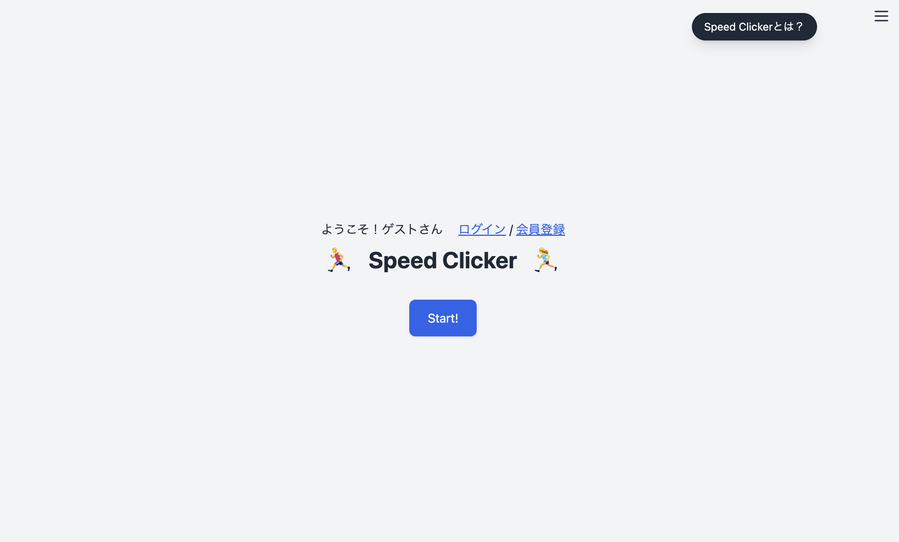
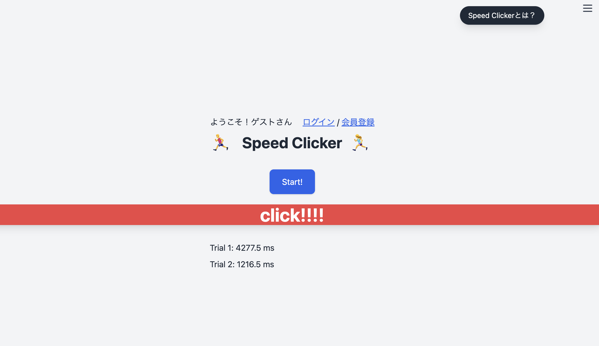

# Speed Clicker

Speed Clicker は、5 回の反応時間を計測し平均スコアを保存できるミニゲームです。
スコア履歴やランキング機能を備えており、ユーザーごとの成績を比較できます。
ゲストモードでもプレイ可能で、ログインユーザーは記録を保存・管理できます。

---

## デモ

> **本番 URL**: [https://speed-clicker.fly.dev/](https://speed-clicker.fly.dev/)
>
> |                  | 画面イメージ             |
> | ---------------- | ------------------------ |
> | ゲームトップ画面 |   |
> | ゲームプレイ画面 |  |

---

## 目的

このアプリは、Laravel + JavaScript を用いたフルスタック開発のスキルを示すことを目的に制作しました。
以下のスキルを実践し、ポートフォリオとして採用担当者に提出できる形を目指しています。

-   認証・API 設計・データベースの活用
-   ゲスト操作やスコア制限の実装
-   UI/UX デザイン（Alpine.js, Tailwind）
-   CI/CD デプロイ体験（Fly.io）

---

## 主な機能

| 機能                 | 説明                                                                 | 開発状況    |
| -------------------- | -------------------------------------------------------------------- | ----------- |
| ゲームプレイ         | 5 回の反応時間を計測し、平均スコアを表示                             | ✅ 実装済み |
| スコア保存           | ログイン済ユーザーは 1 日 10 件までスコアを保存可能                  | ✅ 実装済み |
| ゲストモード対応     | ログインなしでもゲーム体験可能（スコア保存は不可）＆ランキング閲覧可 | ✅ 実装済み |
| スコア履歴ページ     | 自分の保存スコアを一覧表示＆削除可能                                 | ✅ 実装済み |
| ランキングページ     | 全ユーザーの上位スコア（トップ 50）を表示。自分の順位も確認可能      | ✅ 実装済み |
| ユーザー情報管理     | ユーザー名・メール・パスワードの変更が可能                           | 🔧 開発中   |
| 管理者ダッシュボード | ユーザー・スコアの一括管理画面                                       | 📝 未着手   |

---

## 技術スタック

| レイヤ         | 技術                                      | 補足                            |
| -------------- | ----------------------------------------- | ------------------------------- |
| バックエンド   | Laravel 10.x / PHP 8.2                    | Breeze + Blade、Sanctum（任意） |
| フロントエンド | Vanilla JS、Vite、Tailwind CSS            | Alpine.js で簡易 UI 制御        |
| データベース   | SQLite（開発） → MySQL/PostgreSQL（本番） | Eloquent ORM                    |
| テスト         | PHPUnit、Vitest （TODO）                  | GitHub Actions で CI            |
| ホスティング   | Render / Fly.io                           | Docker なしデプロイ             |

---

## ER 図 / アーキテクチャ

```
users
└─ id PK
   name
   email
   password

scores
└─ id PK
   user_id FK → users.id ON DELETE CASCADE
   average_score FLOAT
   created_at
```

---

## ページ構成

| パス        | 概要                                       |
| ----------- | ------------------------------------------ |
| `/`         | `/game` にリダイレクト                     |
| `/game`     | ゲーム画面（ゲストも可）                   |
| `/login`    | ログイン画面                               |
| `/register` | 新規登録画面                               |
| `/history`  | スコア履歴一覧（削除可）                   |
| `/ranking`  | ランキング表示（上位 50 件＋自分のスコア） |
| `/profile`  | プロフィール編集                           |

---

## ローカル環境構築

```
# 1. プロジェクトを取得
git clone git@github.com:yourname/speed-clicker.git
cd speed-clicker

# 2. PHP / JS パッケージをインストール
composer install
npm install

# 3. 環境設定
cp .env.example .env
php artisan key:generate

# 4. DB作成・初期化
touch database/database.sqlite
php artisan migrate

# 5. 開発サーバ起動（2つのターミナルで別々に実行）
npm run dev
php artisan serve
```

---

## デプロイ手順（概要）

1. GitHub に push
2. Fly.io でアプリをホスティング
3. Build コマンド: `composer install && npm ci && npm run build`
4. リリース時に `php artisan migrate --force` を実行
5. `.env` など環境変数の設定も Fly.io 上で行う

---

## テスト・CI(予定)

-   `php artisan test`：Laravel 側の API・モデルが正しく動くか確認するテスト
-   `vitest run`：クリック平均を出す JS の計算処理を自動でチェックするテスト（予定）
-   GitHub Actions：コードを GitHub にアップした時、自動でテストを走らせる仕組みを今後追加予定

---

## TODO

-   [ ] ページネーションと CSV エクスポート
-   [ ] レスポンシブ対応とダークモード
-   [ ] CI: PHPStan、ESLint、PHPUnit を PR 時に実行
-   [ ] Mermaid ER 図を README に追加
-   [ ] Vitest で平均計算ロジックをテスト
-   [ ] JS: 平均スコアを数値で送る（文字列 →float）
-   [ ] JS: alert() をトースト通知に変更

---

## 作者

-   Name: Doi
-   TechAcademy（PHP/Laravel コース）卒業 2025

---

バグ報告や改善提案は Issues/PR でお知らせください。
